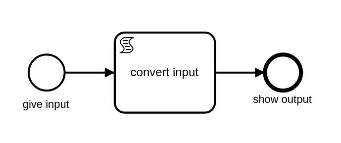

# ScriptTask with XSLT — OrqueIO BPM Example

> **Note:** This example requires the XSLT script engine extension, which is part of the OrqueIO Platform.

## Overview

This example demonstrates how to use a **BPMN ScriptTask** with the XSLT script engine in OrqueIO to transform XML data within a process. The example is classless — it relies entirely on scripting (Groovy and XSLT) with no custom Java delegates.

### Process diagram



The process consists of three steps:

| Step | Type | Role |
|------|------|------|
| Start Event | Execution Listener (Groovy) | Loads the XML input file into a process variable |
| Script Task | XSLT | Transforms the XML data and stores the result |
| End Event | Execution Listener (Groovy) | Prints the transformed result |

---

## Requirements

| Requirement | Version |
|-------------|---------|
| Java | 21+ |
| Maven | 3.6+ |

---

## Project structure

```
xslt-scripttask/
├── pom.xml
└── src/
    ├── main/resources/
    │   ├── xslt-example.bpmn                              # BPMN process definition
    │   └── io/orqueio/bpm/example/xsltexample/
    │       ├── example.xml                                # Input XML data
    │       ├── example.xsl                                # XSLT stylesheet
    │       ├── readXmlFile.groovy                         # Groovy: load input
    │       └── printResult.groovy                         # Groovy: print output
    └── test/
        ├── java/.../XsltExampleTest.java                  # Unit test
        └── resources/
            ├── expected_result.xml                        # Expected transformation output
            └── orqueio.cfg.xml                            # In-memory engine configuration
```

---

## How it works

### 1. Start Event — load input data

An execution listener runs a Groovy script at the end of the start event. It reads the XML file from the classpath and stores it in the `customers` process variable.

```xml
<bpmn2:startEvent id="StartEvent_1" name="give input">
  <bpmn2:extensionElements>
    <camunda:executionListener event="end">
      <camunda:script scriptFormat="groovy"
                      resource="io/orqueio/bpm/example/xsltexample/readXmlFile.groovy"/>
    </camunda:executionListener>
  </bpmn2:extensionElements>
</bpmn2:startEvent>
```

```groovy
import io.orqueio.commons.utils.IoUtil

xmlData = IoUtil.fileAsString('io/orqueio/bpm/example/xsltexample/example.xml')
execution.setVariable('customers', xmlData)
```

### 2. Script Task — XSLT transformation

The ScriptTask uses the XSLT engine to transform the `customers` variable and stores the result in `xmlOutput`.

```xml
<bpmn2:scriptTask id="ScriptTask_1"
                  name="convert input"
                  scriptFormat="xslt"
                  camunda:resource="io/orqueio/bpm/example/xsltexample/example.xsl"
                  camunda:resultVariable="xmlOutput">
  <bpmn2:extensionElements>
    <camunda:inputOutput>
      <camunda:inputParameter name="camunda_source">${customers}</camunda:inputParameter>
    </camunda:inputOutput>
  </bpmn2:extensionElements>
</bpmn2:scriptTask>
```

Key attributes:

| Attribute | Value | Description |
|-----------|-------|-------------|
| `scriptFormat` | `xslt` | Activates the XSLT script engine |
| `camunda:resource` | path to `.xsl` file | Stylesheet loaded from classpath |
| `camunda:resultVariable` | `xmlOutput` | Process variable where the result is stored |
| `camunda_source` (input parameter) | `${customers}` | XML content passed to the XSLT engine |

**Transformation example:**

Input (`customers`):
```xml
<customers>
  <customer>
    <firstName>Fozzie</firstName>
    <lastName>Bear</lastName>
    <dateOfBirth>05.09.1976</dateOfBirth>
  </customer>
</customers>
```

Output (`xmlOutput`):
```xml
<users>
  <user>
    <name>Fozzie</name>
    <familyname>Bear</familyname>
    <birthday>05.09.1976</birthday>
  </user>
</users>
```

### 3. End Event — print result

An execution listener runs a second Groovy script at the start of the end event. It retrieves and prints the `xmlOutput` variable.

```groovy
println '\nTransformed XML:'
println execution.getVariable('xmlOutput')
```

---

## Running the example

### Known requirement — Java 21

Maven must use JDK 21. If your default `JAVA_HOME` points to an older JDK, set it explicitly before running:

**Linux / Git Bash:**
```bash
JAVA_HOME="/path/to/jdk-21" mvn clean test
```

**PowerShell:**
```powershell
$env:JAVA_HOME = 'C:\Path\To\jdk-21'
mvn clean test
```

### Run the tests

```bash
mvn clean test
```

Expected output:
```
Tests run: 1, Failures: 0, Errors: 0, Skipped: 0
```

The test:
1. Starts an in-memory OrqueIO engine (H2)
2. Deploys `xslt-example.bpmn`
3. Starts a process instance
4. Asserts that the transformed XML matches `expected_result.xml`

---

## Source files

| File | Description |
|------|-------------|
| [xslt-example.bpmn](src/main/resources/xslt-example.bpmn) | BPMN process definition |
| [example.xsl](src/main/resources/io/orqueio/bpm/example/xsltexample/example.xsl) | XSLT stylesheet |
| [example.xml](src/main/resources/io/orqueio/bpm/example/xsltexample/example.xml) | Input XML data |
| [expected_result.xml](src/test/resources/expected_result.xml) | Expected transformation output |
| [XsltExampleTest.java](src/test/java/io/orqueio/bpm/example/xsltexample/XsltExampleTest.java) | Unit test |
| [orqueio.cfg.xml](src/test/resources/orqueio.cfg.xml) | In-memory engine configuration |