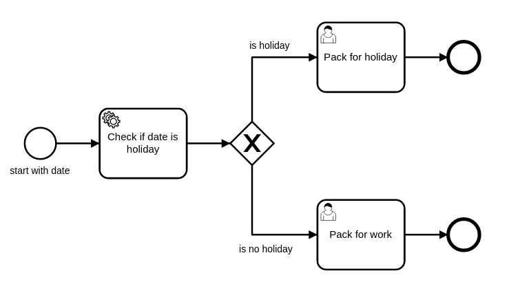

# REST Service Task — OrqueIO BPM Example

This example demonstrates how to use a **BPMN ServiceTask** with the built-in HTTP connector to call a REST API and make a process decision based on the response. The example is classless — it relies entirely on scripting and expression language, using **OrqueIO Connect** for HTTP calls and **OrqueIO Spin** for JSON parsing.

### Process diagram



The process receives a date as input, queries a public holiday API, and routes accordingly:

```
[Start] → [ServiceTask: Check if date is holiday] → <Gateway> ──→ [UserTask: Pack for holiday]
                                                               ↘→ [UserTask: Pack for work]
```

---

## Requirements

| Requirement | Version |
|-------------|---------|
| Java | 21+ |
| Maven | 3.6+ |
| Internet access | Required (live REST API call) |

---

## Project structure

```
rest-service/
├── pom.xml
└── src/
    ├── main/resources/
    │   ├── invoiceRestService.bpmn       # BPMN process definition
    │   └── parseHoliday.js               # JavaScript: parse JSON response with Spin
    └── test/
        ├── java/.../ServiceTaskRestTest.java   # Unit tests (2 scenarios)
        └── resources/
            └── orqueio.cfg.xml                # In-memory engine configuration
```

---

## How it works

### 1. ServiceTask — HTTP connector

The ServiceTask uses the `http-connector` provided by OrqueIO Connect. The entire HTTP call is configured directly in the BPMN — no Java code required.

```xml
<bpmn2:serviceTask id="ServiceTask_1" name="Check if date is holiday">
  <bpmn2:extensionElements>
    <camunda:connector>
      <camunda:connectorId>http-connector</camunda:connectorId>
      <camunda:inputOutput>

        <camunda:inputParameter name="url">
          http://feiertage.jarmedia.de/api/?jahr=2014&amp;nur_land=BE
        </camunda:inputParameter>

        <camunda:inputParameter name="method">GET</camunda:inputParameter>

        <camunda:inputParameter name="headers">
          <camunda:map>
            <camunda:entry key="Accept">application/json</camunda:entry>
          </camunda:map>
        </camunda:inputParameter>

        <camunda:outputParameter name="isHoliday">
          <camunda:script scriptFormat="Javascript" resource="parseHoliday.js"/>
        </camunda:outputParameter>

      </camunda:inputOutput>
    </camunda:connector>
  </bpmn2:extensionElements>
</bpmn2:serviceTask>
```

Key connector parameters:

| Parameter | Role |
|-----------|------|
| `camunda:connectorId` | Identifies the HTTP connector |
| `url` | REST endpoint to call |
| `method` | HTTP method (`GET`, `POST`, etc.) |
| `headers` | HTTP request headers |
| `outputParameter` | Maps the response to a process variable |

### 2. JSON parsing — OrqueIO Spin + JavaScript

The HTTP response is raw JSON. The `parseHoliday.js` script uses OrqueIO Spin's JSONPath support to check whether the given date appears in the list of holidays:

```javascript
const response = connector.getVariable("response");  // raw HTTP response body
const date = connector.getVariable("date");           // process variable: date to check

const holidays = S(response);                         // Spin parses the JSON
const query = `$..[?(@.datum=='${date}')]`;           // JSONPath: find matching date

!holidays.jsonPath(query).elementList().isEmpty();    // returns true if date is a holiday
```

The result (`true` or `false`) is stored in the process variable `isHoliday`.

### 3. Exclusive gateway — routing based on `isHoliday`

```xml
<!-- Route 1: it's a holiday -->
<bpmn2:sequenceFlow name="is holiday" ...>
  <bpmn2:conditionExpression>${isHoliday}</bpmn2:conditionExpression>
</bpmn2:sequenceFlow>

<!-- Route 2: it's a work day -->
<bpmn2:sequenceFlow name="is no holiday" ...>
  <bpmn2:conditionExpression>${!isHoliday}</bpmn2:conditionExpression>
</bpmn2:sequenceFlow>
```

---

## Setup — Connect and Spin plugins

Connect and Spin are optional OrqueIO extensions. They must be declared as dependencies in `pom.xml`:

```xml
<!-- HTTP connector plugin -->
<dependency>
  <groupId>io.orqueio.bpm</groupId>
  <artifactId>orqueio-engine-plugin-connect</artifactId>
</dependency>

<dependency>
  <groupId>io.orqueio.connect</groupId>
  <artifactId>orqueio-connect-http-client</artifactId>
</dependency>

<!-- JSON/XML parsing plugin -->
<dependency>
  <groupId>io.orqueio.bpm</groupId>
  <artifactId>orqueio-engine-plugin-spin</artifactId>
</dependency>

<dependency>
  <groupId>io.orqueio.spin</groupId>
  <artifactId>orqueio-spin-dataformat-json-jackson</artifactId>
</dependency>
```

Both plugins must also be registered with the process engine in `orqueio.cfg.xml`:

```xml
<property name="processEnginePlugins">
  <list>
    <bean class="io.orqueio.connect.plugin.impl.ConnectProcessEnginePlugin"/>
    <bean class="io.orqueio.spin.plugin.impl.SpinProcessEnginePlugin"/>
  </list>
</property>
```

This enables:
- `http-connector` usage in ServiceTasks (Connect)
- `S()` function and JSONPath support in scripts (Spin)

---

## Running the example

### Known requirement — Java 21

Maven must use JDK 21. If your default `JAVA_HOME` points to an older JDK, set it explicitly:

**Linux / Git Bash:**
```bash
JAVA_HOME="/path/to/jdk-21" mvn clean test
```

**PowerShell:**
```powershell
$env:JAVA_HOME = 'C:\Path\To\jdk-21'
mvn clean test
```

### Run the tests

```bash
mvn clean test
```

Expected output:
```
Tests run: 2, Failures: 0, Errors: 0, Skipped: 0
```

### Test scenarios

| Test | Input date | Expected task |
|------|-----------|---------------|
| `shouldPackForHoliday` | `2014-04-21` (Easter Monday) | "Pack for holiday" |
| `shouldPackForWork` | `2014-01-02` | "Pack for work" |

> Both tests make **live HTTP calls** to `feiertage.jarmedia.de`. An internet connection is required.

---

## Source files

| File | Description |
|------|-------------|
| [invoiceRestService.bpmn](src/main/resources/invoiceRestService.bpmn) | BPMN process definition |
| [parseHoliday.js](src/main/resources/parseHoliday.js) | JavaScript: JSON response parsing with Spin |
| [ServiceTaskRestTest.java](src/test/java/io/orqueio/bpm/example/servicetask/rest/ServiceTaskRestTest.java) | Unit tests |
| [orqueio.cfg.xml](src/test/resources/orqueio.cfg.xml) | In-memory engine configuration |