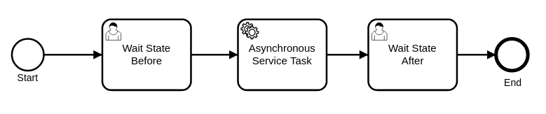
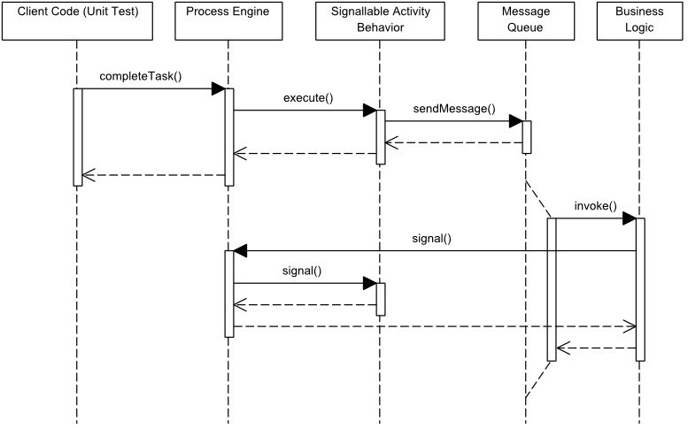

# Asynchronous Service Invocation — OrqueIO BPM Example

> **Note:** This example uses the `SignallableActivityBehavior` internal API.
> For most use cases, a **Send Task + Receive Task** pair is the recommended alternative.

This example demonstrates how to implement an **asynchronous service invocation** in OrqueIO using the `SignallableActivityBehavior` interface. The service task acts as a wait state: it sends a message to a queue, then suspends until it receives a callback signal from the external service.

### Process diagram



| Step | Type | Role |
|------|------|------|
| Wait State Before | UserTask | Initial wait state — manually triggered |
| Asynchronous Service Task | ServiceTask | Sends message to queue, then suspends |
| Wait State After | UserTask | Reached only after successful service callback |

---

## Requirements

| Requirement | Version |
|-------------|---------|
| Java | 21+ |
| Maven | 3.6+ |

---

## Project structure

```
service-invocation-asynchronous/
├── pom.xml
├── docs/                                              # Diagrams and screenshots
└── src/
    ├── main/
    │   ├── java/.../invocation/
    │   │   ├── AsynchronousServiceTask.java           # SignallableActivityBehavior implementation
    │   │   ├── BusinessLogic.java                     # External service logic (sends callback)
    │   │   └── MockMessageQueue.java                  # Mock queue infrastructure
    │   └── resources/
    │       └── asynchronousServiceInvocation.bpmn     # BPMN process definition
    └── test/
        ├── java/.../TestAsynchronousServiceTask.java  # 2 test scenarios
        └── resources/
            └── orqueio.cfg.xml                        # In-memory engine configuration
```

---

## How it works

### Core concept — SignallableActivityBehavior

A standard `JavaDelegate` executes synchronously and immediately advances the process. `SignallableActivityBehavior` changes this: the engine **suspends** after `execute()` returns and only resumes when `signal()` is explicitly called externally.

```
Process Engine                         External Service
     │                                        │
     │── execute() ──── sends to queue ──────>│
     │                                        │
     │  [suspended, state flushed to DB]      │  (processes message)
     │                                        │
     │<── signal(executionId) ───────────────-│  (sends callback)
     │                                        │
     │  [resumes, moves to next activity]     │
```



---

### 1. AsynchronousServiceTask — wait state implementation

Extends `AbstractBpmnActivityBehavior` and implements two lifecycle methods:

```java
public class AsynchronousServiceTask extends AbstractBpmnActivityBehavior {

  public void execute(final ActivityExecution execution) {
    // Build payload with execution ID as correlation key
    Map<String, Object> payload = new HashMap<>(execution.getVariables());
    payload.put(EXECUTION_ID, execution.getId());

    // Enqueue message — returns immediately
    // Engine suspends here and waits for signal()
    MockMessageQueue.INSTANCE.send(new Message(payload));
  }

  public void signal(ActivityExecution execution, String signalName, Object signalData) {
    // Called by the external service callback — resumes and leaves the activity
    leave(execution);
  }
}
```

Referenced in the BPMN via `camunda:class`:

```xml
<bpmn2:serviceTask id="serviceTaskActivity"
    name="Asynchronous Service Task"
    camunda:class="io.orqueio.quickstart.servicetask.invocation.AsynchronousServiceTask">
```

### 2. BusinessLogic — external service with callback

Processes the message and signals the engine using `executionId` as the correlation key:

```java
public void invoke(Message message, ProcessEngine processEngine) {
  String executionId = (String) message.getPayload().get(AsynchronousServiceTask.EXECUTION_ID);
  Boolean shouldFail  = (Boolean) message.getPayload().get(SHOULD_FAIL_VAR_NAME);

  if (shouldFail) {
    // Exception isolated — process engine is NOT affected, no rollback
    throw new RuntimeException("Service invocation failure!");
  } else {
    // Send callback with result — resumes the waiting process instance
    Map<String, Object> callbackPayload = Collections.singletonMap(PRICE_VAR_NAME, PRICE);
    processEngine.getRuntimeService().signal(executionId, callbackPayload);
  }
}
```

### 3. MockMessageQueue — queue infrastructure

A simple in-memory list simulating a real messaging system (JMS, RabbitMQ, Kafka, etc.):

```java
MockMessageQueue.INSTANCE.send(message);       // called by AsynchronousServiceTask
MockMessageQueue.INSTANCE.getNextMessage();    // called by consumer (test or real worker)
```

In production, replace this with a transactional message broker to guarantee delivery.

---

## Failure behavior

A key property of this pattern: **service failures are isolated from the process engine.**

| Scenario | Process engine state |
|----------|---------------------|
| Service succeeds | `signal()` called → process advances to "Wait State After", `price = 199.0` set |
| Service fails (exception) | Process stays suspended in service task — no rollback, no incident created |

> `signal()` cannot automatically create an Incident. Error handling (retries, dead-letter queues, alerts) must be managed by the external service infrastructure.

---

## Running the example

### Known requirement — Java 21

Maven must use JDK 21. If your default `JAVA_HOME` points to an older JDK, set it explicitly:

**Linux / Git Bash:**
```bash
JAVA_HOME="/path/to/jdk-21" mvn clean test
```

**PowerShell:**
```powershell
$env:JAVA_HOME = 'C:\Path\To\jdk-21'
mvn clean test
```

### Run the tests

```bash
mvn clean test
```

Expected output:
```
Tests run: 2, Failures: 0, Errors: 0, Skipped: 0
```

### Test scenarios

| Test | `shouldFail` | Expected outcome |
|------|-------------|-----------------|
| `shouldCallServiceSuccessfully` | `false` | Process advances to "Wait State After", `price = 199.0` set |
| `shouldCallServiceWithFailure` | `true` | Exception thrown, process stays suspended in service task |

---

## Source files

| File | Description |
|------|-------------|
| [asynchronousServiceInvocation.bpmn](src/main/resources/asynchronousServiceInvocation.bpmn) | BPMN process definition |
| [AsynchronousServiceTask.java](src/main/java/io/orqueio/quickstart/servicetask/invocation/AsynchronousServiceTask.java) | SignallableActivityBehavior implementation |
| [BusinessLogic.java](src/main/java/io/orqueio/quickstart/servicetask/invocation/BusinessLogic.java) | External service logic with callback |
| [MockMessageQueue.java](src/main/java/io/orqueio/quickstart/servicetask/invocation/MockMessageQueue.java) | Mock queue infrastructure |
| [TestAsynchronousServiceTask.java](src/test/java/io/orqueio/quickstart/servicetask/invocation/sync/TestAsynchronousServiceTask.java) | Unit tests |
| [orqueio.cfg.xml](src/test/resources/orqueio.cfg.xml) | In-memory engine configuration |
