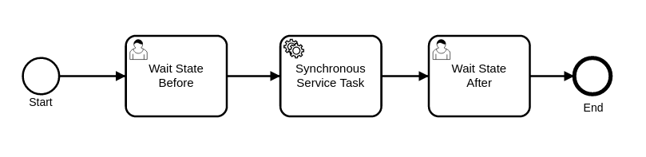
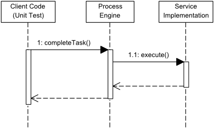

# Synchronous Service Invocation — OrqueIO BPM Example

This example demonstrates how to implement a **synchronous service invocation** in OrqueIO using the `JavaDelegate` interface. The service task executes in the same thread as the process engine, participates in the same transaction, and triggers an automatic rollback on failure.

### Process diagram



| Step | Type | Role |
|------|------|------|
| Wait State Before | UserTask | Initial wait state — manually triggered |
| Synchronous Service Task | ServiceTask | Executes JavaDelegate synchronously |
| Wait State After | UserTask | Reached only after successful execution |

---

## Requirements

| Requirement | Version |
|-------------|---------|
| Java | 21+ |
| Maven | 3.6+ |

---

## Project structure

```
service-invocation-synchronous/
├── pom.xml
├── docs/                                              # Diagrams and screenshots
└── src/
    ├── main/
    │   ├── java/.../invocation/sync/
    │   │   └── SynchronousServiceTask.java            # JavaDelegate implementation
    │   └── resources/
    │       └── synchronousServiceInvocation.bpmn      # BPMN process definition
    └── test/
        ├── java/.../TestSynchronousServiceTask.java   # 2 test scenarios
        └── resources/
            └── orqueio.cfg.xml                        # In-memory engine configuration
```

---

## How it works

### Core concept — JavaDelegate

`JavaDelegate` is the standard and simplest way to implement a ServiceTask in OrqueIO. The engine calls `execute()` synchronously on the **same thread** as the caller, blocking until the method returns.

```
Client Thread (e.g. taskService.complete())
     │
     │── advance to ServiceTask
     │── invoke JavaDelegate.execute()  ←── blocking call
     │       │
     │       │  business logic runs here
     │       │  (same thread, same transaction)
     │       │
     │◄──────┘  returns
     │
     │── advance to next activity
```



---

### 1. SynchronousServiceTask — JavaDelegate implementation

Implements `io.orqueio.bpm.engine.delegate.JavaDelegate`:

```java
public class SynchronousServiceTask implements JavaDelegate {

  public void execute(DelegateExecution execution) {
    boolean shouldFail = (Boolean) execution.getVariable(SHOULD_FAIL_VAR_NAME);

    if (shouldFail) {
      // Exception triggers transaction rollback — process returns to "Wait State Before"
      throw new RuntimeException("Service invocation failure!");
    } else {
      // Set result variable — visible to subsequent steps in the process
      execution.setVariable(PRICE_VAR_NAME, PRICE);
    }
  }
}
```

Referenced in the BPMN via `camunda:class`:

```xml
<bpmn2:serviceTask id="ServiceTask_1"
    name="Synchronous Service Task"
    camunda:class="io.orqueio.quickstart.servicetask.invocation.sync.SynchronousServiceTask">
```

---

### 2. Transaction and failure behavior

The synchronous model provides strong transactional guarantees:

| Scenario | Process engine behavior |
|----------|------------------------|
| `execute()` succeeds | Process advances to "Wait State After", `price = 199.0` set |
| `execute()` throws exception | **Transaction rollback** — process returns to last persistent state ("Wait State Before") |

This is the key advantage over the asynchronous pattern: **failures are handled automatically via rollback**, with no need for external retry infrastructure.

> The stacktrace printed in the logs during the failure test is **expected** — it is logged by the engine when it intercepts the exception before rolling back.

---

## Running the example

### Known requirement — Java 21

Maven must use JDK 21. If your default `JAVA_HOME` points to an older JDK, set it explicitly:

**Linux / Git Bash:**
```bash
JAVA_HOME="/path/to/jdk-21" mvn clean test
```

**PowerShell:**
```powershell
$env:JAVA_HOME = 'C:\Path\To\jdk-21'
mvn clean test
```

### Run the tests

```bash
mvn clean test
```

Expected output:
```
Tests run: 2, Failures: 0, Errors: 0, Skipped: 0
```

> The error stacktrace in the console output during tests is intentional — it is produced by the `shouldCallServiceWithFailure` test scenario.

### Test scenarios

| Test | `shouldFail` | Expected outcome |
|------|-------------|-----------------|
| `shouldCallServiceSuccessfully` | `false` | Process advances to "Wait State After", `price = 199.0` set |
| `shouldCallServiceWithFailure` | `true` | Exception thrown, **rollback** — process stays in "Wait State Before", `price` not set |

---

## JavaDelegate vs SignallableActivityBehavior

| | `JavaDelegate` (this example) | `SignallableActivityBehavior` |
|-|-------------------------------|-------------------------------|
| Execution | Synchronous — same thread | Asynchronous — suspends and waits |
| Transaction | Shared with engine | Isolated from engine |
| Failure handling | Automatic rollback | Manual (external retry logic) |
| Complexity | Simple | Advanced |
| Recommended for | Most service invocations | Long-running or external async services |

---

## Source files

| File | Description |
|------|-------------|
| [synchronousServiceInvocation.bpmn](src/main/resources/synchronousServiceInvocation.bpmn) | BPMN process definition |
| [SynchronousServiceTask.java](src/main/java/io/orqueio/quickstart/servicetask/invocation/sync/SynchronousServiceTask.java) | JavaDelegate implementation |
| [TestSynchronousServiceTask.java](src/test/java/io/orqueio/quickstart/servicetask/invocation/sync/TestSynchronousServiceTask.java) | Unit tests |
| [orqueio.cfg.xml](src/test/resources/orqueio.cfg.xml) | In-memory engine configuration |