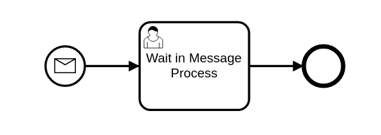
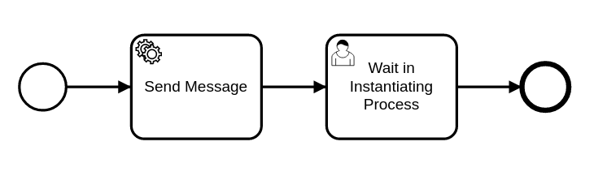

# Message Start Event — OrqueIO BPM Example

This example demonstrates how to start a BPMN process using a **Message Start Event**. Instead of being started manually or by a timer, the process is instantiated when a specific named message is sent to the engine.

The example involves two separate process definitions that interact with each other through a message.

---

## Requirements

| Requirement | Version |
|-------------|---------|
| Java | 21+ |
| Maven | 3.6+ |

---

## Project structure

```
message-start/
├── pom.xml
└── src/
    ├── main/
    │   ├── java/.../event/message/
    │   │   └── InstantiateProcessByMessageDelegate.java  # JavaDelegate: sends the message
    │   └── resources/
    │       ├── message_start_process.bpmn                # Process started by message
    │       └── instantiating_process.bpmn                # Process that sends the message
    └── test/
        ├── java/.../MessageStartEventTest.java           # Unit test
        └── resources/
            └── orqueio.cfg.xml                           # In-memory engine configuration
```

---

## How it works

### The two processes

#### Process 1 — Message Start Process



This process **cannot be started manually** — it only starts when it receives the message `instantiationMessage`. The message start event is declared in the BPMN:

```xml
<bpmn2:startEvent id="StartEvent_1">
  <bpmn2:messageEventDefinition messageRef="Message_1"/>
</bpmn2:startEvent>

<bpmn2:message id="Message_1" name="instantiationMessage"/>
```

Once started, the process advances to a UserTask "Wait in Message Process".

#### Process 2 — Instantiating Process



This process starts normally and contains a ServiceTask that sends the `instantiationMessage` to the engine, which triggers the start of Process 1.

```
[Start] → [ServiceTask: Send Message] → [UserTask: Wait in Instantiating Process] → [End]
```

### The JavaDelegate — sending the message

`InstantiateProcessByMessageDelegate` uses the `RuntimeService` to correlate the message:

```java
public void execute(DelegateExecution execution) {
  RuntimeService runtimeService = execution.getProcessEngineServices().getRuntimeService();
  runtimeService.startProcessInstanceByMessage("instantiationMessage");
}
```

`startProcessInstanceByMessage()` tells the engine to find a deployed process definition with a matching message start event and instantiate it. The call is synchronous — when it returns, the new process instance has been created and has advanced to its first wait state.

### Execution flow

```
1. Test starts "Instantiating_Process"
2. Engine executes ServiceTask → InstantiateProcessByMessageDelegate.execute()
3. Delegate calls runtimeService.startProcessInstanceByMessage("instantiationMessage")
4. Engine creates a new instance of "Message_Start_Process"
5. Both processes are now waiting at their respective UserTasks
```

After step 5, there are **2 active process instances** in the engine simultaneously.

---

## Running the example

### Known requirement — Java 21

Maven must use JDK 21. If your default `JAVA_HOME` points to an older JDK, set it explicitly:

**Linux / Git Bash:**
```bash
JAVA_HOME="/path/to/jdk-21" mvn clean test
```

**PowerShell:**
```powershell
$env:JAVA_HOME = 'C:\Path\To\jdk-21'
mvn clean test
```

### Run the tests

```bash
mvn clean test
```

Expected output:
```
Tests run: 1, Failures: 0, Errors: 0, Skipped: 0
```

### What the test verifies

| Assertion | Expected value |
|-----------|---------------|
| Total active process instances | `2` |
| UserTask in Instantiating_Process | "Wait in Instantiating Process" |
| UserTask in Message_Start_Process | "Wait in Message Process" |

---

## Source files

| File | Description |
|------|-------------|
| [message_start_process.bpmn](src/main/resources/message_start_process.bpmn) | Process definition with message start event |
| [instantiating_process.bpmn](src/main/resources/instantiating_process.bpmn) | Process definition that sends the message |
| [InstantiateProcessByMessageDelegate.java](src/main/java/io/orqueio/bpm/example/event/message/InstantiateProcessByMessageDelegate.java) | JavaDelegate that sends the message |
| [MessageStartEventTest.java](src/test/java/io/orqueio/bpm/example/event/message/MessageStartEventTest.java) | Unit test |
| [orqueio.cfg.xml](src/test/resources/orqueio.cfg.xml) | In-memory engine configuration |